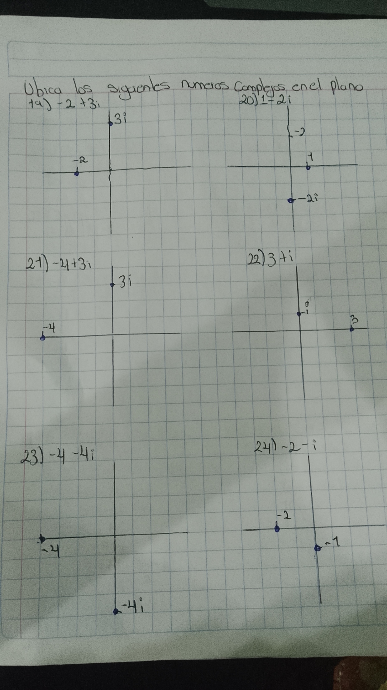

# Fundamentos de algebra

**Ubicar números reales en la recta numérica**
1): $√2, -3.5, 5.7, 0, -1/2$

```matematicas
<------|-------|-------|-------|-------|------>
      -3.5   -1/2      0       √2     5.7
```

2): $π, -1.2, 5, 3/4, e$

```matematicas
<------|-------|-------|-------|-------|------>
      -1.2    3/4      e       π       5
```

3): $3, e/2, -5, π, 1/4, -1.5, ln2$

```matematicas
<------|-------|-------|-------|-------|------|-------|------>
      -5     -1.5     1/4      ln2    e/2     3       π
```

4): $π/4, -6, 1.25, e, -3/4, 4, ln3$

```matematicas
<------|-------|-------|-------|-------|------|-------|------>
      -6     -3/4     π/4      ln3    1.25    e       4
```

5): $-0.2, -6, π/3, -2, 0.75, ln5, -5/4$

```matematicas
<------|-------|-------|-------|-------|------|-------|------>
      -2     -5/4     -0.2    0.75    π/3     ln5     6
```

6): $0.5, 8, π/2, -7, e/3, -2/3, -3.2$

```matematicas
<------|-------|-------|-------|-------|------|-------|------>
      -7     -3.2    -2/3     0.5    e/3     π/2      8
```

**Indica los conjuntos al que pertenece el número real y explica por qué**
7): $7 \in \mathbb{N}, \mathbb{Z}, \mathbb{Q}, \mathbb{R}$
Es un entero positivo, por lo que pertenece a los naturales y a los enteros. Tambien es racional porque tambien se puede escribir como fraccion por lo cual tambien es real

8): $-10 \in \mathbb{Z}, \mathbb{Q}, \mathbb{R}$
Es un entero negativo, por lo que pertenece a los enteros. Tambien es racional porque tambien se puede escribir como fraccion por lo cual tambien es real

9): $7/3 \in \mathbb{Q}, \mathbb{R}$
Esta escrito como fraccion por lo que es un numero racional y por lo cual tambien es real

10): $Φ  \in \mathbb{I}, \mathbb{R}$
Es una constante matematica con decimales no periodicos y no se puede expresar como una fraccion simple de numeros enteros por lo que es irracional y real

11): $π/4  \in \mathbb{I}, \mathbb{R}$
π es un numero irracional, la division da un numero con  infinitos decimales no periodicos por lo que es irracional y real

12): $√9 \in \mathbb{N}, \mathbb{Z}, \mathbb{Q}, \mathbb{R}$
El resultado de √9 es un entero positivo, por lo que pertenece a los naturales y a los enteros. Tambien es racional porque tambien se puede escribir como fraccion por lo cual tambien es real

**Usando PEMDAS, resuelve la siguientes expresiones aritméticas**
13): $6 - (3 - 1)$
$$
\begin{array}{l c l}
6 - \textcolor{red}{(3 - 1)} & & \text{1. Se resuelve el paréntesis} \\
\textcolor{red}{6 - 2} & & \text{2. Se resuelve la resta} \\
4 & &   \\
\end{array}
$$

El resultado de $6 - (3 - 1) = 4$

14): $18 \div (2 + 4)$
$$
\begin{array}{l c l}
18 \div \textcolor{red}{(2 + 4)} & & \text{1. Se resuelve el paréntesis} \\
\textcolor{red}{18 \div 6} & & \text{2. Se resuelve la división} \\
3 & &   \\
\end{array}
$$

El resultado de $18 \div (2 + 4) = 3$

15): $(9 \times -3+(1-2)\div-1+5)\times 3$
$$
\begin{array}{l c l}
(9 \times -3 + \textcolor{red}{(1 - 2)} \div -1 + 5) \times 3 & & \text{1. Se resuelve el paréntesis interior} \\
( \textcolor{red}{9 \times -3} + -1 \div -1 + 5) \times 3 & & \text{2. Multiplicaciones y divisiones en el paréntesis} \\
 & & \text{de izquierda a derecha} \\
(-27 + \textcolor{red}{-1 \div -1} + 5) \times 3 & & \text{3. Se resuelve la división} \\
(\textcolor{red}{-27 + 1} + 5) \times 3 & & \text{4. Sumas y restas dentro del paréntesis de izquierda} \\
 & & \text{a derecha} \\
\textcolor{red}{(-26 + 5)} \times 3 & & \text{5. Se resuelve la suma restante en el paréntesis} \\
\textcolor{red}{-21 \times 3} & & \text{6. Se resuelve la multiplicación final} \\
-63 & & \\
\end{array}
$$

El resultado de $(9 \times -3+(1-2)\div-1+5)\times 3 = -63$

16): $7 \times 3 \times -1((-28 \times 2) \div 8 + 9)$

$$

\begin{array}{l c l}

7 \times 3 \times -1(\textcolor{red}{(-28 \times 2)} \div 8 + 9) & & \text{1. Se resuelve el paréntesis más interno} \\

7 \times 3 \times -1(\textcolor{red}{-56 \div 8} + 9) & & \text{2. Se resuelve la división dentro del paréntesis} \\

7 \times 3 \times -1\textcolor{red}{(-7 + 9)} & & \text{3. Se resuelve la suma dentro del paréntesis} \\

\textcolor{red}{7 \times 3} \times -1(2) & & \text{4. Multiplicaciones de izquierda a derecha} \\

\textcolor{red}{21 \times -1}(2) & & \text{5. Siguiente multiplicación} \\

\textcolor{red}{-21 \times 2} & & \text{6. Multiplicación final} \\

-42 & & \\

\end{array}

$$

El resultado de $7 \times 3 \times -1((-28 \times 2) \div 8 + 9) = -42$

17): $(22 + -6 \times 2 + 17 - 7) \div (2 \times 2)$

$$

\begin{array}{l c l}

(22 + \textcolor{red}{-6 \times 2} + 17 - 7) \div (2 \times 2) & & \text{1. Se resuelve la multiplicación en el primer paréntesis} \\
(\textcolor{red}{22 + -12} + 17 - 7) \div (2 \times 2) & & \text{2. Sumas y restas en el primer paréntesis de izquierda} \\
 & & \text{a derecha} \\

(\textcolor{red}{10 + 17} - 7) \div (2 \times 2) & & \text{3. Siguiente suma} \\

\textcolor{red}{(27 - 7)} \div (2 \times 2) & & \text{4. Última resta del primer paréntesis} \\

20 \div \textcolor{red}{(2 \times 2)} & & \text{5. Se resuelve el segundo paréntesis} \\

\textcolor{red}{20 \div 4} & & \text{6. Se resuelve la división} \\

5 & & \\

\end{array}

$$

El resultado de $(22 + -6 \times 2 + 17 - 7) \div (2 \times 2) = 5$

18): $(4 - 1) \times -8 \div (5 - (4 + 1) - 1)$

$$
\begin{array}{l c l}
\textcolor{red}{(4 - 1)} \times -8 \div (5 - (4 + 1) - 1) & & \text{1. Primero resolvemos el paréntesis }(4 - 1) \\
\textcolor{red}{3 \times -8} \div (5 - \textcolor{red}{(4 + 1)} - 1) & & \text{2. Luego simplificamos }(4 + 1) = 5 \\
3 \times -8 \div (\textcolor{red}{5 - 5} - 1) & & \text{3. Continuamos con la resta dentro del paréntesis} \\
3 \times -8 \div \textcolor{red}{(0 - 1)} & & \text{4. Resolvemos la última resta }(0 - 1) \\
\textcolor{red}{-24 \div -1} & & \text{5. Ahora realizamos la división final} \\
\textcolor{red}{24} & & \text{6. Resultado final} \\
\end{array}
$$

El resultado de $(4 - 1) \times -8 \div (5 - (4 + 1) - 1) = 24$




25): $(-7 - 4i) - (2 + i)$

$$
\begin{array}{l c l}
	(-7 - 4i) - (2 + i) & & \text{1. Se quitan los paréntesis} \\
	-7 - 2 - 4i - i & & \text{2. Se agrupan términos semejantes} \\
	\textcolor{red}{-9 - 5i} & & \text{3. Se suman las partes real e imaginaria} \\
\end{array}
$$

Respuesta: $-9 - 5i$

26): $(2 - 4i) - (5 - 3i)$

$$
\begin{array}{l c l}
	(2 - 4i) - (5 - 3i) & & \text{1. Se quitan los paréntesis} \\
2 - 5 - 4i + 3i & & \text{2. Se agrupan términos semejantes} \\
	\textcolor{red}{-3 - i} & & \text{3. Se realiza la resta} \\
\end{array}
$$

Respuesta: $-3 - i$

27): $(7 - 8i) - (3i) - 7$

$$
\begin{array}{l c l}
	(7 - 8i) - 3i - 7 & & \text{1. Se ordenan las partes reales e imaginarias} \\
	7 - 7 - 8i - 3i & & \text{2. Se agrupan términos semejantes} \\
	\textcolor{red}{0 - 11i} & & \text{3. Se simplifica la parte real} \\
	\textcolor{red}{-11i} & & \text{4. Resultado} \\
\end{array}
$$

Respuesta: $-11i$

28): $(1 + 5i) + (-8 - 5i) + 3$

$$
\begin{array}{l c l}
(1 + 5i) + (-8 - 5i) + 3 & & \text{1. Se quitan los paréntesis} \\
1 - 8 + 3 + 5i - 5i & & \text{2. Se agrupan términos semejantes} \\
\textcolor{red}{-4 + 0i} & & \text{3. Se cancelan las partes imaginarias} \\
\textcolor{red}{-4} & & \text{4. Resultado} \\
\end{array}
$$

Respuesta: $-4$

29): $-8 - (3 - 5i) + (4 + 8i)$

$$
\begin{array}{l c l}
-8 - (3 - 5i) + (4 + 8i) & & \text{1. Se distribuyen los signos} \\
-8 - 3 + 5i + 4 + 8i & & \text{2. Se agrupan términos semejantes} \\
\textcolor{red}{-7 + 13i} & & \text{3. Se suman las partes real e imaginaria} \\
\end{array}
$$

Respuesta: $-7 + 13i$

30): $(-4 + 2i) + (3i) + (-4 - 7i)$

$$
\begin{array}{l c l}
(-4 + 2i) + 3i + (-4 - 7i) & & \text{1. Se quitan los paréntesis} \\
-4 - 4 + 2i + 3i - 7i & & \text{2. Se agrupan términos semejantes} \\
\textcolor{red}{-8 - 2i} & & \text{3. Se suman las partes real e imaginaria} \\
\end{array}
$$

Respuesta: $-8 - 2i$

31): $(2i)(-4i)$

$$
\begin{array}{l c l}
(2i)(-4i) & & \text{1. Se multiplican los coeficientes} \\
-8i^2 & & \text{2. Se usa } i^2 = -1 \\
\textcolor{red}{8} & & \text{3. Resultado} \\
\end{array}
$$

Respuesta: $8$

32): $(-2i)(5i) \times 6$

$$
\begin{array}{l c l}
(-2i)(5i) & & \text{1. Se multiplican los factores imaginarios} \\
-10i^2 & & \text{2. Se usa } i^2 = -1 \\
10 \times 6 & & \text{3. Se multiplica por 6} \\
\textcolor{red}{60} & & \text{4. Resultado} \\
\end{array}
$$

Respuesta: $60$

33): $(-7i)(8 + 8i)(-2 - 8i)$

$$
\begin{array}{l c l}
(-7i)(8 + 8i) & & \text{1. Se distribuye } -7i \\
-56i - 56i^2 & & \text{2. Se usa } i^2 = -1 \\
extcolor{red}{56 - 56i} & & \text{3. Primer producto} \\
(56 - 56i)(-2 - 8i) & & \text{4. Se distribuye el segundo factor} \\
-112 - 448i + 112i + 448i^2 & & \text{5. Se desarrolla el producto} \\
\textcolor{red}{-560 - 336i} & & \text{6. Se simplifica} \\
\end{array}
$$

Respuesta: $-560 - 336i$

34): $(-2 - 4i)(-1 - 6i)(7 - 6i)$

$$
\begin{array}{l c l}
(-2 - 4i)(-1 - 6i) & & \text{1. Se desarrolla el primer producto} \\
2 + 12i + 4i + 24i^2 & & \text{2. Se distribuyen los términos} \\
\textcolor{red}{-22 + 16i} & & \text{3. Se usa } i^2 = -1 \\
(-22 + 16i)(7 - 6i) & & \text{4. Se multiplica por el tercer factor} \\
-154 + 132i + 112i - 96i^2 & & \text{5. Se desarrolla el producto} \\
\textcolor{red}{-58 + 244i} & & \text{6. Se simplifica} \\
\end{array}
$$

Respuesta: $-58 + 244i$

35): $(3i)(1 - 7i)(7 + 4i)$

$$
\begin{array}{l c l}
(3i)(1 - 7i) & & \text{1. Se distribuye } 3i \\
3i - 21i^2 & & \text{2. Se usa } i^2 = -1 \\
\textcolor{red}{21 + 3i} & & \text{3. Primer producto} \\
(21 + 3i)(7 + 4i) & & \text{4. Se desarrolla el segundo producto} \\
147 + 84i + 21i + 12i^2 & & \text{5. Se agrupan términos} \\
\textcolor{red}{135 + 105i} & & \text{6. Se simplifica} \\
\end{array}
$$

Respuesta: $135 + 105i$

36): $(-6i)(-5 + i)(6 - 2i)$

$$
\begin{array}{l c l}
(-6i)(-5 + i) & & \text{1. Se distribuye } -6i \\
30i - 6i^2 & & \text{2. Se usa } i^2 = -1 \\
\textcolor{red}{6 + 30i} & & \text{3. Primer producto} \\
(6 + 30i)(6 - 2i) & & \text{4. Se desarrolla el segundo producto} \\
36 - 12i + 180i - 60i^2 & & \text{5. Se agrupan términos} \\
\textcolor{red}{96 + 168i} & & \text{6. Se simplifica} \\
\end{array}
$$

Respuesta: $96 + 168i$

37): $\dfrac{10 - 7i}{1 + 3i}$

$$
\begin{array}{l c l}
\frac{10 - 7i}{1 + 3i} \cdot \frac{1 - 3i}{1 - 3i} & & \text{1. Se multiplica por el conjugado} \\
\frac{(10 - 7i)(1 - 3i)}{1 + 9} & & \text{2. Se simplifica el denominador} \\
\textcolor{red}{\frac{-11 - 37i}{10}} & & \text{3. Se desarrolla y simplifica} \\
\end{array}
$$

Respuesta: $\dfrac{-11 - 37i}{10}$

38): $\dfrac{4 + 2i}{-1 - 10i}$

$$
\begin{array}{l c l}
	\frac{4 + 2i}{-1 - 10i} \cdot \frac{-1 + 10i}{-1 + 10i} & & \text{1. Se multiplica por el conjugado} \\
	\frac{(4 + 2i)(-1 + 10i)}{1 + 100} & & \text{2. Se calcula el denominador} \\
	\textcolor{red}{\frac{-24 + 38i}{101}} & & \text{3. Se desarrolla y simplifica} \\
\end{array}
$$

Respuesta: $\dfrac{-24 + 38i}{101}$

39): $\dfrac{1 + 4i}{-1 - 6i}$

$$
\begin{array}{l c l}
	\frac{1 + 4i}{-1 - 6i} \cdot \frac{-1 + 6i}{-1 + 6i} & & \text{1. Se multiplica por el conjugado} \\
	\frac{(1 + 4i)(-1 + 6i)}{1 + 36} & & \text{2. Se calcula el denominador} \\
	\textcolor{red}{\frac{-25 + 2i}{37}} & & \text{3. Se desarrolla y simplifica} \\
\end{array}
$$

Respuesta: $\dfrac{-25 + 2i}{37}$

40): $\dfrac{-8 + 4i}{1 + i}$

$$
\begin{array}{l c l}
	\frac{-8 + 4i}{1 + i} \cdot \frac{1 - i}{1 - i} & & \text{1. Se multiplica por el conjugado} \\
	\frac{-4 + 12i}{2} & & \text{2. Se desarrolla numerador y denominador} \\
	\textcolor{red}{-2 + 6i} & & \text{3. Se divide entre 2} \\
\end{array}
$$

Respuesta: $-2 + 6i$

41): $\dfrac{-10 + 8i}{6 + i}$

$$
\begin{array}{l c l}
	\frac{-10 + 8i}{6 + i} \cdot \frac{6 - i}{6 - i} & & \text{1. Se multiplica por el conjugado} \\
	\frac{(-10 + 8i)(6 - i)}{36 + 1} & & \text{2. Se calcula el denominador} \\
	\textcolor{red}{\frac{-52 + 58i}{37}} & & \text{3. Se desarrolla y simplifica} \\
\end{array}
$$

Respuesta: $\dfrac{-52 + 58i}{37}$

42): $\dfrac{2 - 2i}{4 - 10i}$

$$
\begin{array}{l c l}
	\frac{2 - 2i}{4 - 10i} \cdot \frac{4 + 10i}{4 + 10i} & & \text{1. Se multiplica por el conjugado} \\
	\frac{28 + 12i}{116} & & \text{2. Se desarrolla numerador y denominador} \\
	\textcolor{red}{\frac{7 + 3i}{29}} & & \text{3. Se simplifica la fracción} \\
\end{array}
$$

Respuesta: $\dfrac{7 + 3i}{29}$

**Calcula el valor absoluto de los siguientes números complejos**

43): $|-9 - 9i|$

$$
\begin{array}{l c l}
	\sqrt{(-9)^2 + (-9)^2} & & \text{1. Se aplica la fórmula del módulo} \\
	\sqrt{81 + 81} & & \text{2. Se calculan los cuadrados} \\
	\textcolor{red}{\sqrt{162} = 9\sqrt{2}} & & \text{3. Se simplifica la raíz} \\
\end{array}
$$

Respuesta: $9\sqrt{2}$

44): $|8 - 6i|$

$$
\begin{array}{l c l}
	\sqrt{8^2 + (-6)^2} & & \text{1. Se aplica la fórmula del módulo} \\
	\sqrt{64 + 36} & & \text{2. Se calculan los cuadrados} \\
	\textcolor{red}{10} & & \text{3. Se obtiene la raíz} \\
\end{array}
$$

Respuesta: $10$

45): $|6 - 3i|$

$$
\begin{array}{l c l}
	\sqrt{6^2 + (-3)^2} & & \text{1. Se aplica la fórmula del módulo} \\
	\sqrt{36 + 9} & & \text{2. Se calculan los cuadrados} \\
	\textcolor{red}{\sqrt{45} = 3\sqrt{5}} & & \text{3. Se simplifica la raíz} \\
\end{array}
$$

Respuesta: $3\sqrt{5}$

46): $|10 + 10i|$

$$
\begin{array}{l c l}
	\sqrt{10^2 + 10^2} & & \text{1. Se aplica la fórmula del módulo} \\
	\sqrt{200} & & \text{2. Se suman los cuadrados} \\
	\textcolor{red}{10\sqrt{2}} & & \text{3. Se simplifica la raíz} \\
\end{array}
$$

Respuesta: $10\sqrt{2}$

47): $|6 - 10i|$

$$
\begin{array}{l c l}
	\sqrt{6^2 + (-10)^2} & & \text{1. Se aplica la fórmula del módulo} \\
	\sqrt{36 + 100} & & \text{2. Se calculan los cuadrados} \\
	\textcolor{red}{\sqrt{136} = 2\sqrt{34}} & & \text{3. Se simplifica la raíz} \\
\end{array}
$$

Respuesta: $2\sqrt{34}$

48): $|-1 + 7i|$

$$
\begin{array}{l c l}
	\sqrt{(-1)^2 + 7^2} & & \text{1. Se aplica la fórmula del módulo} \\
	\sqrt{1 + 49} & & \text{2. Se calculan los cuadrados} \\
	\textcolor{red}{\sqrt{50} = 5\sqrt{2}} & & \text{3. Se simplifica la raíz} \\
\end{array}
$$

Respuesta: $5\sqrt{2}$

**Resuelve las siguientes potencias de $i$**

49): $i^5$

$$
\begin{array}{l c l}
	\textcolor{red}{i^5 = i^4 \cdot i} & & \text{1. Se separa la potencia} \\
	\textcolor{red}{1 \cdot i} & & \text{2. Se usa } i^4 = 1 \\
	\textcolor{red}{i} & & \text{3. Resultado} \\
\end{array}
$$

Respuesta: $i$

50): $i^{10}$

$$
\begin{array}{l c l}
	\textcolor{red}{i^{10} = (i^4)^2 \cdot i^2} & & \text{1. Se separa la potencia en múltiplos de 4} \\
	\textcolor{red}{1 \cdot (-1)} & & \text{2. Se usan } i^4 = 1 \text{ e } i^2 = -1 \\
	\textcolor{red}{-1} & & \text{3. Resultado} \\
\end{array}
$$

Respuesta: $-1$

51): $i^{20}$

$$
\begin{array}{l c l}
	\textcolor{red}{i^{20} = (i^4)^5} & & \text{1. Se expresa 20 como múltiplo de 4} \\
	\textcolor{red}{1^5} & & \text{2. Se usa } i^4 = 1 \\
	\textcolor{red}{1} & & \text{3. Resultado} \\
\end{array}
$$

Respuesta: $1$

52): $i^{35}$

$$
\begin{array}{l c l}
	\textcolor{red}{i^{35} = i^{32} \cdot i^3} & & \text{1. Se separa la potencia} \\
	\textcolor{red}{1 \cdot (-i)} & & \text{2. Se usan } i^{32} = 1 \text{ e } i^3 = -i \\
	\textcolor{red}{-i} & & \text{3. Resultado} \\
\end{array}
$$

Respuesta: $-i$

53): $i^{256}$

$$
\begin{array}{l c l}
	\textcolor{red}{i^{256} = (i^4)^{64}} & & \text{1. Se expresa 256 como múltiplo de 4} \\
	\textcolor{red}{1^{64}} & & \text{2. Se usa } i^4 = 1 \\
	\textcolor{red}{1} & & \text{3. Resultado} \\
\end{array}
$$

Respuesta: $1$

54): $i^{55}$

$$
\begin{array}{l c l}
	\textcolor{red}{i^{55} = i^{52} \cdot i^3} & & \text{1. Se separa la potencia} \\
	\textcolor{red}{1 \cdot (-i)} & & \text{2. Se usan } i^{52} = 1 \text{ e } i^3 = -i \\
	\textcolor{red}{-i} & & \text{3. Resultado} \\
\end{array}
$$

Respuesta: $-i$

**Convierte los siguientes números complejos a su forma polar**

55): $6 - 8i$

$$
\begin{array}{l c l}
	\textcolor{red}{r = \sqrt{6^2 + (-8)^2}} & & \text{1. Se calcula el módulo} \\
	\textcolor{red}{r = \sqrt{36 + 64} = 10} & & \text{2. Se simplifica la raíz} \\
\end{array}
$$

$$
\begin{array}{l c l}
	\textcolor{red}{\theta = \tan^{-1}\left(\frac{-8}{6}\right)} & & \text{3. Se calcula el ángulo} \\
	\textcolor{red}{\theta \approx 306.87^\circ} & & \text{4. Se expresa en el intervalo }[0^\circ,360^\circ) \\
\end{array}
$$

Forma polar: $10(\cos 306.87^\circ + i\sin 306.87^\circ)$

56): $5\sqrt{2} + 5\sqrt{2}i$

$$
\begin{array}{l c l}
	\textcolor{red}{r = \sqrt{(5\sqrt{2})^2 + (5\sqrt{2})^2}} & & \text{1. Se calcula el módulo} \\
	\textcolor{red}{r = \sqrt{50 + 50} = 10} & & \text{2. Se simplifica la raíz} \\
\end{array}
$$

$$
\begin{array}{l c l}
	\textcolor{red}{\theta = \tan^{-1}\left(\frac{5\sqrt{2}}{5\sqrt{2}}\right)} & & \text{3. Se calcula el ángulo} \\
	\textcolor{red}{\theta = 45^\circ} & & \text{4. Se identifica el primer cuadrante} \\
\end{array}
$$

Forma polar: $10(\cos 45^\circ + i\sin 45^\circ)$

57): $2 - 2\sqrt{3}i$

$$
\begin{array}{l c l}
	\textcolor{red}{r = \sqrt{2^2 + (2\sqrt{3})^2}} & & \text{1. Se calcula el módulo} \\
	\textcolor{red}{r = \sqrt{4 + 12} = 4} & & \text{2. Se simplifica la raíz} \\
\end{array}
$$

$$
\begin{array}{l c l}
	\textcolor{red}{\theta = \tan^{-1}\left(\frac{-2\sqrt{3}}{2}\right)} & & \text{3. Se calcula el ángulo de referencia} \\
	\textcolor{red}{\theta = 300^\circ} & & \text{4. Se ubica en el cuarto cuadrante} \\
\end{array}
$$

Forma polar: $4(\cos 300^\circ + i\sin 300^\circ)$

58): $\dfrac{3\sqrt{3}}{2} - \dfrac{3}{2}i$

$$
\begin{array}{l c l}
	\textcolor{red}{r = \sqrt{\left(\frac{3\sqrt{3}}{2}\right)^2 + \left(-\frac{3}{2}\right)^2}} & & \text{1. Se calcula el módulo} \\
	\textcolor{red}{r = \sqrt{\frac{27}{4} + \frac{9}{4}} = 3} & & \text{2. Se simplifica la raíz} \\
\end{array}
$$

$$
\begin{array}{l c l}
	\textcolor{red}{\theta = \tan^{-1}\left(\frac{-3/2}{3\sqrt{3}/2}\right)} & & \text{3. Se calcula el ángulo de referencia} \\
	\textcolor{red}{\theta = 330^\circ} & & \text{4. Se ubica en el cuarto cuadrante} \\
\end{array}
$$

Forma polar: $3(\cos 330^\circ + i\sin 330^\circ)$

59): $-2$

$$
\begin{array}{l c l}
	\textcolor{red}{r = |-2| = 2} & & \text{1. Se calcula el módulo} \\
	\textcolor{red}{\theta = 180^\circ} & & \text{2. El número está sobre el eje real negativo} \\
\end{array}
$$

Forma polar: $2(\cos 180^\circ + i\sin 180^\circ)$

60): $-7i$

$$
\begin{array}{l c l}
	\textcolor{red}{r = |-7i| = 7} & & \text{1. Se calcula el módulo} \\
	\textcolor{red}{\theta = 270^\circ} & & \text{2. El número está sobre el eje imaginario negativo} \\
\end{array}
$$

Forma polar: $7(\cos 270^\circ + i\sin 270^\circ)$

**Convierte los números complejos de su forma polar a su forma rectangular**

61): $\cos 30^\circ + i\sin 30^\circ$

$$
\begin{array}{l c l}
	\textcolor{red}{\cos 30^\circ = \frac{\sqrt{3}}{2}, \quad \sin 30^\circ = \frac{1}{2}} & & \text{1. Se sustituyen los valores trigonométricos} \\
	\textcolor{red}{\frac{\sqrt{3}}{2} + \frac{1}{2}i} & & \text{2. Se escribe la forma rectangular} \\
\end{array}
$$

Respuesta: $\dfrac{\sqrt{3}}{2} + \dfrac{1}{2}i$

62): $2(\cos 60^\circ + i\sin 60^\circ)$

$$
\begin{array}{l c l}
	\textcolor{red}{2\left(\frac{1}{2} + i\frac{\sqrt{3}}{2}\right)} & & \text{1. Se sustituyen seno y coseno} \\
	\textcolor{red}{1 + \sqrt{3}i} & & \text{2. Se distribuye el módulo }2 \\
\end{array}
$$

Respuesta: $1 + \sqrt{3}i$

63): $1.5(\cos 90^\circ + i\sin 90^\circ)$

$$
\begin{array}{l c l}
	\textcolor{red}{1.5(0 + i)} & & \text{1. Se sustituyen }\cos 90^\circ=0\text{ y }\sin 90^\circ=1 \\
	\textcolor{red}{1.5i} & & \text{2. Se multiplica por el módulo} \\
\end{array}
$$

Respuesta: $1.5i$

64): $2.5(\cos 120^\circ + i\sin 120^\circ)$

$$
\begin{array}{l c l}
	\textcolor{red}{2.5\left(-\frac{1}{2} + i\frac{\sqrt{3}}{2}\right)} & & \text{1. Se sustituyen seno y coseno} \\
	\textcolor{red}{-\frac{5}{4} + \frac{5\sqrt{3}}{4}i} & & \text{2. Se distribuye el módulo }2.5 \\
\end{array}
$$

Respuesta: $-\dfrac{5}{4} + \dfrac{5\sqrt{3}}{4}i$

65): $4(\cos 135^\circ + i\sin 135^\circ)$

$$
\begin{array}{l c l}
	\textcolor{red}{4\left(-\frac{\sqrt{2}}{2} + i\frac{\sqrt{2}}{2}\right)} & & \text{1. Se sustituyen seno y coseno} \\
	\textcolor{red}{-2\sqrt{2} + 2\sqrt{2}i} & & \text{2. Se distribuye el módulo }4 \\
\end{array}
$$

Respuesta: $-2\sqrt{2} + 2\sqrt{2}i$

66): $3(\cos 180^\circ + i\sin 180^\circ)$

$$
\begin{array}{l c l}
	\textcolor{red}{3(-1 + 0i)} & & \text{1. Se sustituyen }\cos 180^\circ=-1\text{ y }\sin 180^\circ=0 \\
	\textcolor{red}{-3} & & \text{2. Se multiplica por el módulo} \\
\end{array}
$$

Respuesta: $-3$

**Obtén TODAS las raíces de los siguientes complejos**

67): Dos raíces cuadradas de $4(\cos 30^\circ + i\sin 30^\circ)$

$$
\begin{array}{l c l}
	\textcolor{red}{r = \sqrt{4} = 2} & & \text{1. Se calcula la raíz del módulo} \\
	\textcolor{red}{\theta_k = \frac{30^\circ + 360^\circ k}{2}} & & \text{2. Se aplica la fórmula de raíces} \\
	\textcolor{red}{k=0,1 \Rightarrow \theta=15^\circ,195^\circ} & & \text{3. Se toman las dos raíces} \\
\end{array}
$$

Las raíces son:

$$
\begin{array}{l c l}
	\textcolor{red}{2(\cos 15^\circ + i\sin 15^\circ)} & & \text{4. Primera raíz} \\
	\textcolor{red}{2(\cos 195^\circ + i\sin 195^\circ)} & & \text{5. Segunda raíz} \\
\end{array}
$$

68): Dos raíces cuadradas de $3(\cos 90^\circ + i\sin 90^\circ)$

$$
\begin{array}{l c l}
	\textcolor{red}{r = \sqrt{3}} & & \text{1. Se calcula la raíz del módulo} \\
	\textcolor{red}{\theta_k = \frac{90^\circ + 360^\circ k}{2}} & & \text{2. Se aplica la fórmula de raíces} \\
	\textcolor{red}{k=0,1 \Rightarrow \theta=45^\circ,225^\circ} & & \text{3. Se toman las dos raíces} \\
\end{array}
$$

Las raíces son:

$$
\begin{array}{l c l}
	\textcolor{red}{\sqrt{3}(\cos 45^\circ + i\sin 45^\circ)} & & \text{4. Primera raíz} \\
	\textcolor{red}{\sqrt{3}(\cos 225^\circ + i\sin 225^\circ)} & & \text{5. Segunda raíz} \\
\end{array}
$$

69): Tres raíces cúbicas de $-4\sqrt{2} + 4\sqrt{2}i$

$$
\begin{array}{l c l}
	\textcolor{red}{r = |-4\sqrt{2} + 4\sqrt{2}i| = 8} & & \text{1. Se calcula el módulo} \\
	\textcolor{red}{\theta = 135^\circ} & & \text{2. Se identifica el argumento} \\
\end{array}
$$

$$
\begin{array}{l c l}
	\textcolor{red}{\sqrt[3]{8} = 2} & & \text{3. Se calcula la raíz cúbica del módulo} \\
	\textcolor{red}{\theta_k = \frac{135^\circ + 360^\circ k}{3}} & & \text{4. Se aplica la fórmula de raíces} \\
	\textcolor{red}{k=0,1,2 \Rightarrow \theta=45^\circ,165^\circ,285^\circ} & & \text{5. Se obtienen los tres ángulos} \\
\end{array}
$$

Las raíces son:

$$
\begin{array}{l c l}
	\textcolor{red}{2(\cos 45^\circ + i\sin 45^\circ)} & & \text{6. Primera raíz} \\
	\textcolor{red}{2(\cos 165^\circ + i\sin 165^\circ)} & & \text{7. Segunda raíz} \\
	\textcolor{red}{2(\cos 285^\circ + i\sin 285^\circ)} & & \text{8. Tercera raíz} \\
\end{array}
$$

70): Tres raíces cúbicas de $-\dfrac{27}{8}$

$$
\begin{array}{l c l}
	\textcolor{red}{r = \left|-\frac{27}{8}\right| = \frac{27}{8}} & & \text{1. Se calcula el módulo} \\
	\textcolor{red}{\theta = 180^\circ} & & \text{2. Se identifica el argumento} \\
\end{array}
$$

$$
\begin{array}{l c l}
	\textcolor{red}{\sqrt[3]{\frac{27}{8}} = \frac{3}{2}} & & \text{3. Se calcula la raíz cúbica del módulo} \\
	\textcolor{red}{\theta_k = \frac{180^\circ + 360^\circ k}{3}} & & \text{4. Se aplica la fórmula de raíces} \\
	\textcolor{red}{k=0,1,2 \Rightarrow \theta=60^\circ,180^\circ,300^\circ} & & \text{5. Se obtienen los tres ángulos} \\
\end{array}
$$

Las raíces son:

$$
\begin{array}{l c l}
	\textcolor{red}{\frac{3}{2}(\cos 60^\circ + i\sin 60^\circ)} & & \text{6. Primera raíz} \\
	\textcolor{red}{-\frac{3}{2}} & & \text{7. Segunda raíz} \\
	\textcolor{red}{\frac{3}{2}(\cos 300^\circ + i\sin 300^\circ)} & & \text{8. Tercera raíz} \\
\end{array}
$$

71): Cinco raíces de $-32i$

$$
\begin{array}{l c l}
	\textcolor{red}{-32i = 32(\cos 270^\circ + i\sin 270^\circ)} & & \text{1. Se convierte a forma polar} \\
\end{array}
$$

$$
\begin{array}{l c l}
	\textcolor{red}{\sqrt[5]{32} = 2} & & \text{2. Se calcula la raíz quinta del módulo} \\
	\textcolor{red}{\theta_k = \frac{270^\circ + 360^\circ k}{5}} & & \text{3. Se aplica la fórmula de raíces} \\
	\textcolor{red}{k=0,1,2,3,4 \Rightarrow \theta=54^\circ,126^\circ,198^\circ,270^\circ,342^\circ} & & \text{4. Se obtienen los cinco ángulos} \\
\end{array}
$$

Las raíces son:

$$
\begin{array}{l c l}
	\textcolor{red}{2(\cos 54^\circ + i\sin 54^\circ)} & & \text{5. Primera raíz} \\
	\textcolor{red}{2(\cos 126^\circ + i\sin 126^\circ)} & & \text{6. Segunda raíz} \\
	\textcolor{red}{2(\cos 198^\circ + i\sin 198^\circ)} & & \text{7. Tercera raíz} \\
	\textcolor{red}{2(\cos 270^\circ + i\sin 270^\circ)} & & \text{8. Cuarta raíz} \\
	\textcolor{red}{2(\cos 342^\circ + i\sin 342^\circ)} & & \text{9. Quinta raíz} \\
\end{array}
$$

72): Seis raíces de $729$

$$
\begin{array}{l c l}
	\textcolor{red}{729 = 729(\cos 0^\circ + i\sin 0^\circ)} & & \text{1. Se convierte a forma polar} \\
\end{array}
$$

$$
\begin{array}{l c l}
	\textcolor{red}{\sqrt[6]{729} = 3} & & \text{2. Se calcula la raíz sexta del módulo} \\
	\textcolor{red}{\theta_k = \frac{0^\circ + 360^\circ k}{6}} & & \text{3. Se aplica la fórmula de raíces} \\
	\textcolor{red}{k=0,1,2,3,4,5 \Rightarrow \theta=0^\circ,60^\circ,120^\circ,180^\circ,240^\circ,300^\circ} & & \text{4. Se obtienen los seis ángulos} \\
\end{array}
$$

Las raíces son:

$$
\begin{array}{l c l}
	\textcolor{red}{3} & & \text{5. Primera raíz} \\
	\textcolor{red}{3(\cos 60^\circ + i\sin 60^\circ)} & & \text{6. Segunda raíz} \\
	\textcolor{red}{3(\cos 120^\circ + i\sin 120^\circ)} & & \text{7. Tercera raíz} \\
	\textcolor{red}{3(\cos 180^\circ + i\sin 180^\circ)} & & \text{8. Cuarta raíz} \\
	\textcolor{red}{3(\cos 240^\circ + i\sin 240^\circ)} & & \text{9. Quinta raíz} \\
	\textcolor{red}{3(\cos 300^\circ + i\sin 300^\circ)} & & \text{10. Sexta raíz} \\
\end{array}
$$


